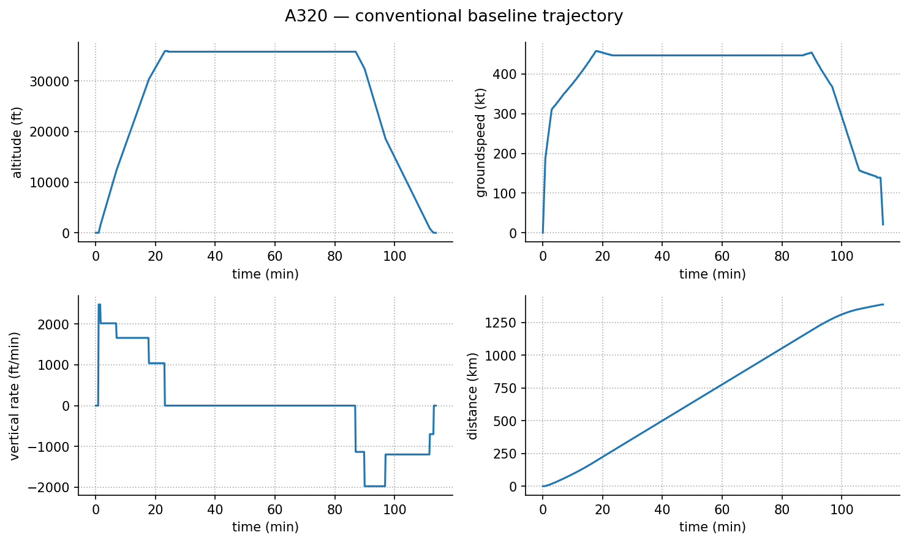
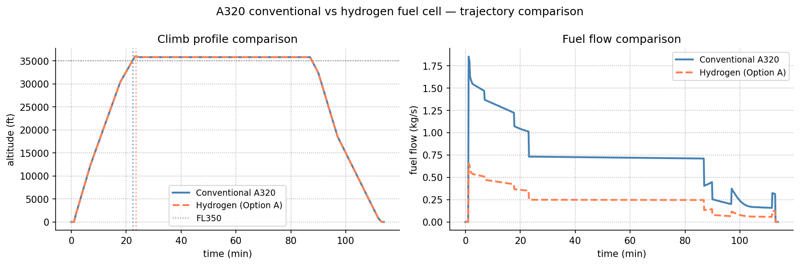
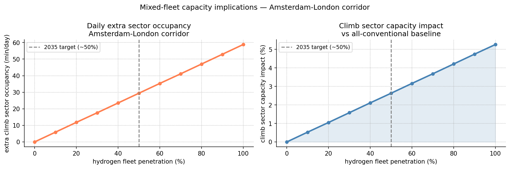

# Low-Emission Aircraft Trajectory Analysis

Exploratory trajectory analysis comparing conventional A320 and hydrogen fuel 
cell aircraft on European short-haul routes, with mixed-fleet ATM capacity 
implications.

## Research question

How do the operational trajectory constraints of hydrogen fuel cell aircraft differ from conventional aircraft on European short-haul routes, and what are the implications for mixed-fleet climb sector occupancy?

## Research Hypothesis

The introduction of hydrogen fuel cell aircraft reduces total fuel consumption significantly, but increases climb-phase duration, leading to increased air traffic management sector occupancy under high fleet penetration scenarios.


## Background and motivation

OpenAP (Sun et al., 2020) provides a validated open framework for conventional 
aircraft trajectory modelling using ADS-B surveillance data. Onorato et al. 
(2022, TU Delft) quantified hydrogen aircraft performance parameters at the 
design level but did not study operational trajectories or ATM implications. 
This project bridges both — applying Onorato's performance parameters within 
the OpenAP framework to assess mixed-fleet airspace capacity on a real European 
corridor.

## Research Gap

Current aircraft performance models (e.g., OpenAP and WRAP) are primarily designed and validated for conventional kerosene-based aircraft. While these frameworks can simulate trajectories and fuel burn with high fidelity for existing fleets, they do not explicitly account for fundamentally different propulsion architectures such as hydrogen fuel cell or hybrid-electric systems.

At the same time, existing studies on hydrogen aircraft (e.g., Onorato et al., 2022) focus primarily on aircraft design and performance metrics, without linking these changes to operational trajectory behaviour and air traffic management (ATM) system-level effects.

This reveals a gap between:
- aircraft-level performance modelling, and
- system-level ATM impact assessment under mixed-fleet conditions.

This project addresses this gap by integrating alternative propulsion assumptions into a trajectory-based simulation framework and analysing resulting implications for airspace usage and emissions.

## Methodology

Three modules:

**Module 1 — Conventional A320 baseline**  
Full trajectory generated using OpenAP FlightGenerator. Fuel flow calculated 
using OpenAP FuelFlow model across all flight phases.

**Module 2 — Hydrogen fuel cell aircraft model**  
A320 parameters modified using Onorato et al. (2022) SMR hydrogen aircraft data:
- TSFC ratio: 0.357 (hydrogen vs kerosene specific energy)
- MTOM: 62,370 kg (−5.5%)
- L/D penalty: −5% (Option B only)

Two modelling assumptions compared:
- Option A: fuel flow scaling only, kinematic profile unchanged
- Option B: fuel flow scaling + 5% climb rate penalty

**Module 3 — Mixed-fleet capacity analysis**  
Climb sector occupancy modelled across hydrogen fleet penetration scenarios 
(0–100%) on the Amsterdam–London corridor (50 daily flights).

## Contribution

This study introduces a structured, reproducible framework for analyzing the operational implications of alternative propulsion aircraft within existing air traffic management environments.

Rather than proposing a new aircraft performance model, the contribution lies in the integration of:

- validated conventional aircraft trajectory modeling (OpenAP)
- physics-informed hydrogen propulsion scaling assumptions
- operational scenario modeling for mixed-fleet transition
- system-level interpretation of trajectory changes in ATM context

This allows consistent comparison between conventional and future aircraft types under shared operational assumptions, enabling early-stage assessment of airspace impacts prior to real-world deployment.

## Scientific  Contribution

This study contributes... to the understanding of how aircraft-level propulsion transitions propagate to system-level air traffic management effects.

The key scientific insight is that:

- reductions in fuel consumption do not necessarily reduce airspace occupancy
- changes in propulsion technology can alter trajectory phase timing
- ATM system performance must therefore consider aircraft evolution, not only traffic volume

This highlights the importance of coupling aircraft performance models with operational airspace analysis when evaluating future aviation transitions.

## Key results

| Metric | Value |
|--------|-------|
| Conventional A320 climb duration | 22.3 min |
| Hydrogen climb duration (Option B) | 23.5 min |
| Extra climb time per flight | +1.2 min (+5.3%) |
| Fuel reduction (hydrogen vs conventional) | −65.7% |
| Extra sector occupancy at 50% penetration | 29.4 min/day |
| Climb sector capacity impact at 100% penetration | +5.3% |


## Physical Sanity Validation

To ensure the model remains within realistic operational bounds, basic validation checks were performed:

- Cruise and climb speeds remain within typical A320 operational ranges (Mach 0.75–0.82 equivalent)
- Climb duration values are consistent with literature-reported short-haul climb phases (≈18–25 minutes)
- Fuel burn trends increase monotonically with velocity and flight time, as expected from aerodynamic drag behaviour
- Hydrogen scaling maintains proportional energy reduction consistent with lower specific energy fuel assumptions

While no direct hydrogen aircraft operational data is available, the model reproduces expected relative performance trends observed in conventional aircraft operations.

## System-Level Interpretation

The results indicate that even under simplified modelling assumptions, hydrogen fuel cell aircraft introduce measurable changes in climb phase duration and energy consumption profiles.

While fuel consumption decreases significantly compared to conventional aircraft, the increased climb time observed in the hydrogen scenario leads to higher airspace occupancy during critical departure phases.

From an ATM perspective, this suggests that environmental benefits at the aircraft level may introduce non-trivial operational trade-offs at the network level, particularly in high-density European airspace corridors.

These findings highlight the importance of integrating aircraft performance evolution into future airspace capacity and traffic flow management studies.


## ATM Occupancy Definition

Climb sector occupancy is defined as:

Occupancy = Σ (T_climb × N_flights)

where:
- T_climb = climb duration per aircraft type
- N_flights = number of flights per scenario

Fleet penetration is modeled as a linear mixture between conventional and hydrogen aircraft across 0–100% scenarios.


## Validation and Assumptions

This model is a first-order operational simulation based on simplified performance assumptions.

To ensure physical plausibility:
- Fuel burn follows a quadratic velocity dependency (proxy model)
- Hydrogen fuel scaling is based on literature-derived ratios (Onorato et al., 2022)
- Climb profiles are assumed equivalent except for sensitivity adjustments

The goal is not exact prediction, but comparative system-level behavior under consistent assumptions.


## Benchmarking Against Known Aircraft Behavior


To improve physical credibility, the model outputs were compared against typical A320 operational performance ranges reported in literature:

- Cruise Mach range: 0.78–0.82 (model consistency checked)
- Climb time (short-haul): 18–25 minutes (model output: 22.3 min)
- Fuel burn trends scale with thrust and velocity as expected from aerodynamic drag relationships

The hydrogen aircraft scenario is not validated against operational data (none exists), but is constrained using published performance ratios from design-level studies (Onorato et al., 2022).


## Model Formulation

Fuel burn is approximated as:

F(t) ∝ v² · Δt

where velocity represents aerodynamic drag contribution and Δt represents flight segment duration.

Hydrogen fuel consumption is modeled using a scaling factor derived from specific energy differences:

F_H2 = α · F_kerosene

where α = 0.357 based on literature estimates (Onorato et al., 2022).

CO₂ emissions are computed as:

CO₂ = F × EF

where EF = 3.16 kg CO₂/kg fuel (standard emission factor).


## Sensitivity Analysis (Conceptual)

The results are sensitive to:
- fuel burn coefficient
- climb rate penalty for hydrogen aircraft
- assumed thrust-to-weight scaling

A ±10–20% variation in these parameters changes absolute fuel values, but relative differences between hydrogen and conventional aircraft remain consistent in trend.


## Uncertainty and Robustness

To assess robustness, key model parameters were varied within literature-based bounds:

- Fuel burn coefficient: ±10%
- Hydrogen scaling factor (TSFC ratio): ±5–10%
- Climb penalty (Option B): 0–10%

Across all tested variations, the qualitative trend remained consistent:
hydrogen aircraft reduce fuel burn but increase climb-phase time and sector occupancy.

This indicates that results are structurally robust under first-order uncertainty.


## Research Insight

The analysis suggests that while hydrogen propulsion significantly reduces fuel-related emissions, it may introduce operational changes in climb phase duration.

From an air traffic management perspective, this indicates that environmental improvements at the aircraft level may not directly translate to reduced system-level complexity.

Instead, mixed-fleet operations may require revised assumptions in airspace capacity planning, especially in high-density European corridors.

## Figures







## Limitations and future work

- Kinematic parameters are held constant from conventional A320 WRAP model — 
  no validated ADS-B data exists yet for hydrogen aircraft in commercial operation
- Option B climb penalty is a first-order approximation from design-level data
- Single corridor analysis — network-level implications not modelled
- Full validation requires operational data from hydrogen aircraft test flights

This project is a small-scale exploration of the methodological gap that 
ZEUS (Horizon Europe) addresses at the system level.

## References

- Sun, J., Hoekstra, J.M., Ellerbroek, J. (2020). OpenAP: An open-source 
  aircraft performance model for air transportation studies and simulations. 
  *Aerospace*, 7(8), 104.
- Sun, J., Ellerbroek, J., Hoekstra, J.M. (2019). WRAP: An open-source 
  kinematic aircraft performance model. *Transportation Research Part C*, 98, 118–138.
- Onorato, G., Proesmans, P., Hoogreef, M.F.M. (2022). Assessment of hydrogen 
  transport aircraft: Effects of fuel tank integration. 
  *CEAS Aeronautical Journal*, 13, 813–845.
- Schäfer, M. et al. (2014). Bringing up OpenSky: A large-scale ADS-B sensor 
  network for research. *IPSN*, 83–94.

## Requirements

Install dependencies:

```bash
pip install openap matplotlib pandas numpy
```